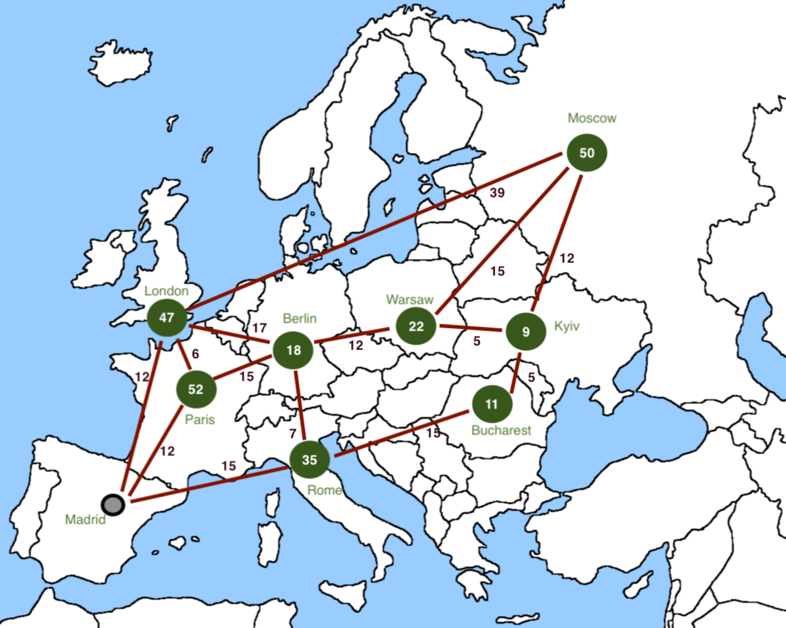

# The Workshop Coding Challenge: P.E.P.I.

The Pan-European Poker Inter-challenge (P.E.P.I.) is about to start.

For a week, the organization is running poker tournaments in the main european capitals.

Every tournament has got interesting prizes for the participants, but one can’t be at all places at the same time, and travelling is expensive.

You’re a skilled poker player based on Madrid who is planning a week of fun and wins. Which is the best route?
 
## Game rules:
- Every city has a reward score, representing the points earned for travelling there.
- Travelling between two connected cities consumes 1 day, and costs an amount of gas (indicated toward the connection).
- You may travel to the same city several times but the reward can be collected only once.
- There’s a maximum duration in days for the trip. The route length can’t exceed the maximum number of days.
- There’s a base city where the route must start and end.
- The optimal route is the one that has the maximum score, which is calculated by: Total rewards – Total gas
- In the case of two or more routes having the same score, the optimal is the shortest of them.
 
For instance, given you have only 5 days and this super-simple roadmap of Europe, the optimal route would be:
 
Madrid – London – Paris – Berlin – Rome – Madrid : 152 – 55 = 97

## Challenge rules:
- Write an application that finds the optimal route given the inputs:
  - A file describing the route map (cities, rewards and connections). Find an example [here](src/test/resources/input/exercise1.json)
  - A maximum duration in days.
- You may choose the coding language of your preference and share your solution with us via GitHub.
  - We have included a scaffold for a Java application in case you want to use it (JDK 10 + JUnit5) but this is completely optional.
- Include a README file explaining how to run the code.
- You may present the results in any way (e.g. console output, a formatted file, etc.). Including:
  - The cities composing the optimal route in order of visiting.
  - Total score calculated.
- We will evaluate the solution considering the following (in order of importance):
  1. Correctness of the solution (it works as expected).
  2. Clean code and design.
  3. A clever and original approach.
  4. Performance of the algorithms.
